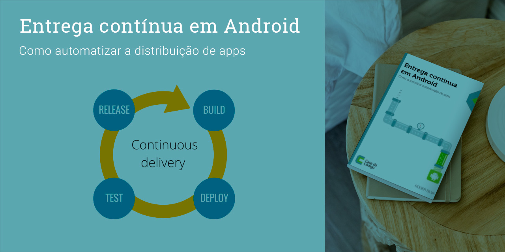

# Entrega contínua em Android
**Como automatizar a distribuição de apps**

Notas e códigos da leitura do livro 

### Sumário

1. Primeiros passos e definições
    1. O problema
    1. Pipeline de deployment
    1. Integração contínua
    1. Entrega contínua x Deployment contínuo
    1. O caso de estudo
1. Gerenciamento de branches
    1. Gerenciando branches em um contexto com integração contínua
    1. Estratégias de branching
1. Testes automatizados
    1. O que é um teste automatizado?
    1. Testes unitários
    1. Análise estática de código
    1. Testes de integração
    1. Testes de integração em Android
    1. Testes funcionais
1. Ferramentas para integração e entrega contínua
    1. Travis CI
    1. GoCD
    1. Jenkins
    1. Comparação entre ferramentas
    1. Publicação no Google Play
1. Distribuições over-the-air
    1. O conceito
    1. Requisitos para atualizações OTA
    1. HockeyApp
    1. Crashlytics
    1. Conclusão

    
[link para loja oficial do livro](https://www.casadocodigo.com.br/products/livro-entrega-continua-android)